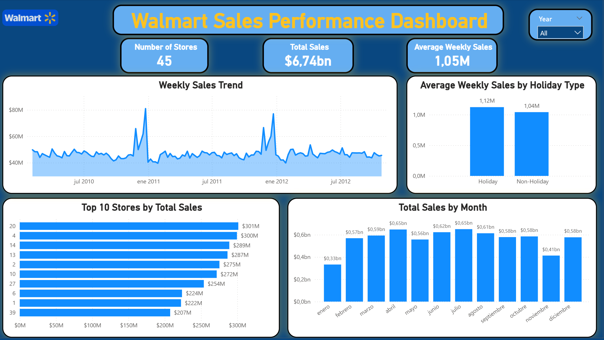

# Walmart Sales Performance Dashboard

Power BI project analyzing Walmart weekly sales performance across 45 stores.

## Dashboard Preview

## Project Overview

This project analyzes Walmart sales data to identify sales trends, seasonal patterns, holiday performance, and top-performing stores.

## Tools Used

- Power BI
- Power Query
- DAX

## Key Features

- Interactive year filter
- Weekly sales trend analysis
- Top 10 stores by total sales
- Holiday vs non-holiday sales comparison
- Monthly sales analysis
- KPI cards for total sales, average weekly sales, and number of stores

## Data Preparation

The dataset was cleaned and transformed using Power Query. Data types were corrected, date attributes were created, and a holiday classification field was added.

## DAX Measures

Measures created for:

- Total Sales
- Average Weekly Sales
- Number of Stores
- Holiday Sales
- Non-Holiday Sales

## Dataset

Public Walmart sales dataset obtained from Kaggle.
